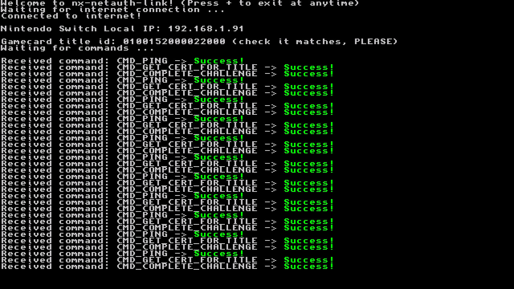

# nx-netauth-link

A utility for Nintendo Switch that facilitates the sharing of the gamecard certificate and utilizes the physical game card to overcome AAuth challenges.

- This is designed to be used with [**NintendoClients**](https://github.com/kinnay/NintendoClients)

**PLEASE BE CAREFUL USING THIS PROGRAM AND SCRIPT, YOU CAN EASILY GET BANNED IF YOU DO NOT PAY ATTENTION AT WHAT YOU ARE DOING**

## Switch homebrew



### Building

```shell
make
nxlink ./nx-netauth-link.nro
```

Requires:

- devkitA64
- [libnx](https://github.com/switchbrew/libnx) (use [this fork](https://github.com/EpicUsername12/libnx) until the real libnx accept the changes)
- make

## Python script

- Get [**NintendoClients**](https://github.com/kinnay/NintendoClients)
- Get your PRODINFO and prod.keys (``sd:/atmosphere/automatic_backups`` and ``sd:/switch``)
- Fill your BAAS credentials (you can get them from your Switch account savefile or a proxy)
- Run nx-netauth-link on your Switch then run the following command

```shell
python ./python/example_mk8dx_get_top_competitions.py
```

### Example output

```
Top 5 popular competitions:
============================
Tournament #1: Mario Kart 8 150cc★ - Red team 'Mario' vs Blue team 'Luigi'
Tournament #2: 200CC TOURNAMENT
Tournament #3: Mario vs Luigi - Red team 'Mario' vs Blue team 'Luigi'
Tournament #4: Gay Racing
Tournament #5: Girls VS Boys - Red team 'Girls' vs Blue team 'Boys'
```

## Known issues

- If the console goes to sleep while the program is running, the console will crash when waking up.